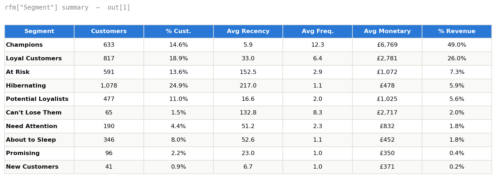
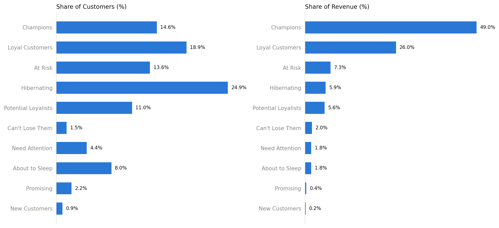
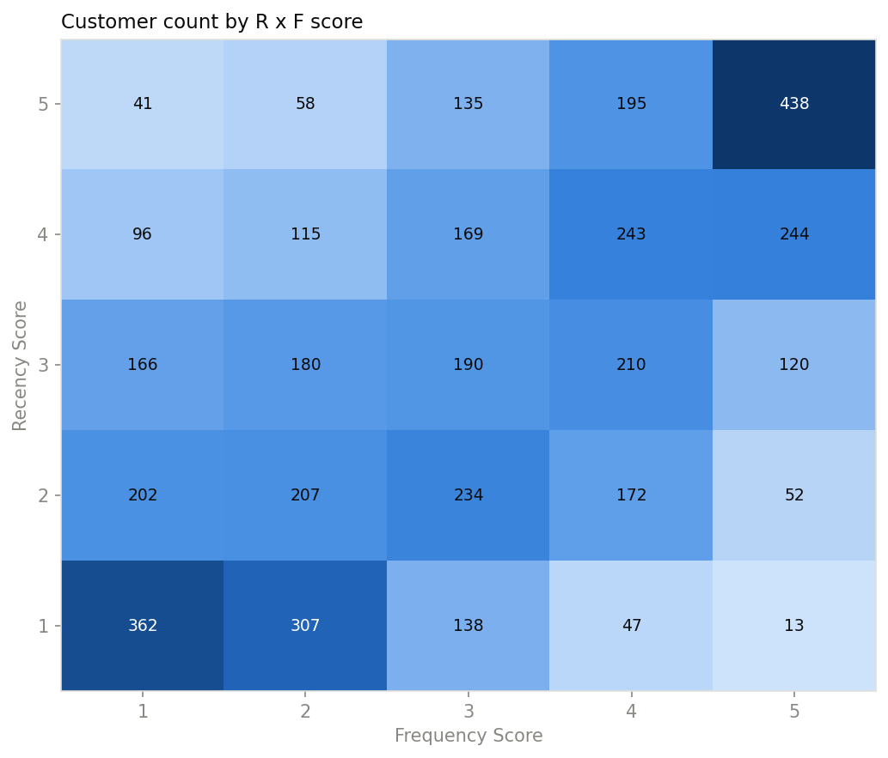
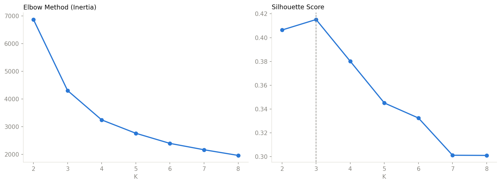
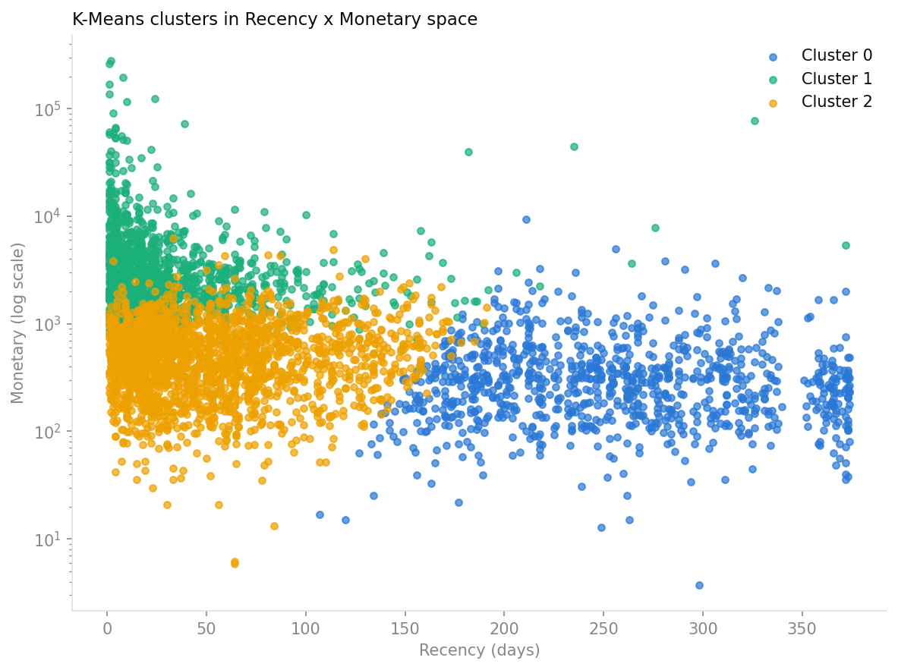

# Customer Segmentation with RFM Analysis


Segmenting 4,334 e-commerce customers into 10 actionable groups using
Recency, Frequency, and Monetary analysis — and turning that into three
quantified recommendations a retention/marketing team could act on this
quarter.

**TL;DR:** 33.5% of customers (Champions + Loyal) generate 75% of revenue,
while the largest single segment (Hibernating, 24.9% of customers)
contributes just 5.9%. That gap is the entire business case for this
project — see [Result](#result).

## Table of Contents
- [Situation](#situation)
- [Task](#task)
- [Action](#action)
- [Result](#result)
- [Bonus: Unsupervised Validation (K-Means)](#bonus-unsupervised-validation-k-means)
- [Repository Structure](#repository-structure)
- [How to Run](#how-to-run)
- [Key Learnings & Limitations](#key-learnings--limitations)
- [Future Improvements](#future-improvements)

## Situation

A UK-based online retailer has ~540K transaction line items spanning a
year, but treats every customer the same way in marketing spend — no
segmentation, no way to tell a lapsing high-value customer from a one-time
browser. Without that distinction, retention budget is either wasted on
customers who were never going to come back, or under-invested in
customers worth actively protecting.

**Dataset:** [Online Retail](https://archive.ics.uci.edu/dataset/352/online+retail)
(UCI ML Repository), accessed via the Kaggle mirror
[`carrie1/ecommerce-data`](https://www.kaggle.com/datasets/carrie1/ecommerce-data)
— 541,909 transaction rows, Dec 2010 to Dec 2011.

## Task

Build a customer segmentation model using RFM (Recency, Frequency,
Monetary) analysis that:
1. Produces a clean, trustworthy transaction dataset from a notoriously
   messy retail export (missing IDs, cancellations, non-product codes).
2. Scores and labels every customer into a named, business-legible segment
   — not just a cluster number.
3. Converts those segments into tactical recommendations with a quantified
   opportunity size, framed the way a C-level stakeholder would ask for it:
   *protect revenue*, *grow revenue*, or *cut wasted spend*.

## Action

**Tech stack:** Python (pandas, NumPy), Matplotlib/Seaborn for
visualization, scikit-learn for the K-Means bonus. See
[`requirements.txt`](requirements.txt).

### 1. Data Cleaning — [`notebooks/01_data_cleaning.py`](notebooks/01_data_cleaning.py)

Every filtering decision is tied to a business reason, not just "drop the
nulls":

| Issue | Finding | Action |
|---|---|---|
| Missing `CustomerID` | 24.93% of rows | Dropped — RFM is customer-level, these rows can't be attributed |
| Duplicate rows | 5,225 rows | Dropped — double-scanned imports |
| Cancelled/returned orders (`Quantity < 0`) | 8,872 invoices (2.21%) | Excluded from the purchase-behavior base table |
| Anomalous `StockCode` (`POST`, `M`, `BANK CHARGES`, `C2`, `PADS`, `DOT`) | 0.39% of rows | Detected **data-drivenly** by counting numeric digits per code (real products are ~5 digits) rather than a hardcoded guess list |
| Service-note `Description` (e.g. "Next Day Carriage") | 0.02% of rows | Detected by scanning for lowercase text (product names are uppercase), then filtered |
| Non-positive `UnitPrice` | 0.01% of rows | Dropped — free items or data errors |

**Result:** 541,909 → **391,068 clean transaction rows**, 4,334 unique
customers.

### 2. RFM Feature Engineering & Scoring — [`notebooks/02_rfm_segmentation.py`](notebooks/02_rfm_segmentation.py)

- **Recency:** days since each customer's last invoice, relative to a
  snapshot date (max invoice date + 1 day).
- **Frequency:** count of distinct invoices per customer.
- **Monetary:** total `Quantity x UnitPrice` per customer.
- **Scoring:** each metric ranked into quintiles (1-5) via `pd.qcut`.
  Recency is inverted (recent = score 5). Ties are broken with
  `.rank(method="first")` before `qcut` — RFM data is heavily tied (many
  customers share Frequency=1), which otherwise breaks quintile binning.

### 3. Segmentation

Recency and Frequency scores are combined into the standard industry 5x5
RFM segment grid (10 named segments: Champions, Loyal Customers, Potential
Loyalists, New Customers, Promising, Need Attention, About to Sleep, At
Risk, Can't Lose Them, Hibernating) — chosen over an unsupervised approach
as the primary method specifically because named segments are directly
actionable by a marketing team without a data scientist translating
cluster IDs. K-Means is used afterward as an independent sanity check —
see [Bonus](#bonus-unsupervised-validation-k-means).

## Result

Sample output — the segment summary table produced by
[`02_rfm_segmentation.py`](notebooks/02_rfm_segmentation.py):





| Segment | % of Customers | % of Revenue |
|---|---|---|
| **Champions** | 14.6% | **49.0%** |
| **Loyal Customers** | 18.9% | 26.0% |
| At Risk | 13.6% | 7.3% |
| **Hibernating** | **24.9%** | 5.9% |
| Potential Loyalists | 11.0% | 5.6% |
| Can't Lose Them | 1.5% | 2.0% |
| Need Attention | 4.4% | 1.8% |
| About to Sleep | 8.0% | 1.8% |
| Promising | 2.2% | 0.4% |
| New Customers | 0.9% | 0.2% |



Full write-up with quantified opportunity sizing:
[**reports/business_recommendations.md**](reports/business_recommendations.md)

1. **Protect** — Win back "At Risk" + "Can't Lose Them" (656 customers,
   historically worth up to £2,717/customer, now 132-153 days inactive).
   Estimated recoverable revenue: **~£202,000**.
2. **Grow** — Upsell/loyalty program for Champions + Loyal Customers (33.5%
   of customers driving 75% of revenue already). Estimated incremental
   revenue: **~£441,000**.
3. **Optimize** — Cap acquisition cost on Hibernating (largest segment,
   weakest ROI ceiling) and reallocate that budget toward Recommendation #1.

*(Revenue estimates are illustrative opportunity sizing based on segment
averages, not measured campaign outcomes — the point is showing the
reasoning, not overclaiming results from public historical data.)*

## Bonus: Unsupervised Validation (K-Means)

**Question:** does an unsupervised method discover roughly the same
customer structure as the rule-based RFM segments above? See
[`notebooks/03_kmeans_clustering.py`](notebooks/03_kmeans_clustering.py).

Frequency and Monetary are log-transformed (heavily right-skewed) and
standardized before clustering. K=3 was selected as optimal by maximizing
the Silhouette score across K=2-8:




| Cluster | Customers | Avg Recency | Avg Frequency | Avg Monetary | Dominant RFM Segment | Overlap |
|---|---|---|---|---|---|---|
| 0 | 986 | 255.0 | 1.4 | £405 | Hibernating | **78.1%** |
| 1 | 1,328 | 30.2 | 9.7 | £5,361 | Loyal Customers | 44.7% |
| 2 | 2,020 | 54.5 | 2.0 | £602 | Potential Loyalists | 22.7% |

**Takeaway:** the two methods agree strongly at the extremes — Cluster 0
overlaps 78.1% with "Hibernating," confirming that segment reflects a real,
distinct behavioral group rather than an artifact of the scoring grid. The
middle segments blend together under K=3 (a high-value cluster mixes
Champions with Loyal Customers; a low-value cluster spans five different
named segments) — which is expected, since 3 unsupervised clusters can't
resolve the granularity that 10 rule-based segments were designed to
capture. This is the actual argument for keeping the rule-based grid as the
primary method: it recovers structure fine-grained enough to target
specific interventions (e.g. distinguishing "Can't Lose Them" from generic
"At Risk"), which K-Means at a business-interpretable K cannot.

## Repository Structure

```
RFM Analysis/
├── LICENSE
├── README.md
├── data/
│   ├── raw/                      # source data (gitignored except README)
│   └── processed/                # cleaned transactions + rfm_segments.csv
├── notebooks/
│   ├── 01_data_cleaning.py       # cell-marked (# %%) — open in VS Code/Jupyter
│   ├── 01_data_cleaning.ipynb    # executed, outputs embedded
│   ├── 02_rfm_segmentation.py
│   ├── 02_rfm_segmentation.ipynb
│   ├── 03_kmeans_clustering.py   # bonus: unsupervised validation
│   └── 03_kmeans_clustering.ipynb
├── outputs/                       # generated charts
├── reports/
│   └── business_recommendations.md
└── requirements.txt
```

## How to Run

```bash
pip install -r requirements.txt
```

Place the dataset (see [`data/raw/README.md`](data/raw/README.md)) at
`data/raw/data.csv`, then run the notebooks in order — either as
Jupyter/VS Code interactive cells (`# %%` markers) or as plain scripts:

```bash
cd notebooks
python 01_data_cleaning.py
python 02_rfm_segmentation.py
python 03_kmeans_clustering.py   # optional bonus
```

Each `.py` script has a matching **executed `.ipynb`** counterpart (e.g.
[`02_rfm_segmentation.ipynb`](notebooks/02_rfm_segmentation.ipynb)) with
every table and chart already embedded — open it directly on GitHub to see
the full run without installing anything.

## Key Learnings & Limitations

- **Data coverage caveat:** ~25% of raw transactions have no `CustomerID`
  (guest checkouts) and are excluded — the segmentation covers identifiable
  customers only, not 100% of gross transaction volume.
- **RFM is a snapshot, not a forecast:** segments reflect behavior up to the
  snapshot date; a production version would need to re-run on a rolling
  schedule and track segment migration over time (e.g. what % of Champions
  become At Risk month over month).
- **Currency:** the source data is in GBP (£); figures above are presented
  as-is from the raw dataset.

## Future Improvements

- **Richer clustering features:** extend the K-Means bonus with behavioral
  (product diversity, cancellation rate) and geographic features, which may
  resolve the blended middle clusters seen at K=3.
- **Cohort/migration analysis:** track how customers move between segments
  month over month to measure whether interventions actually work.
- **A/B test the recommendations:** validate the estimated revenue impact
  in [Result](#result) against a real holdout group before rolling out.

## License

[MIT](LICENSE)
